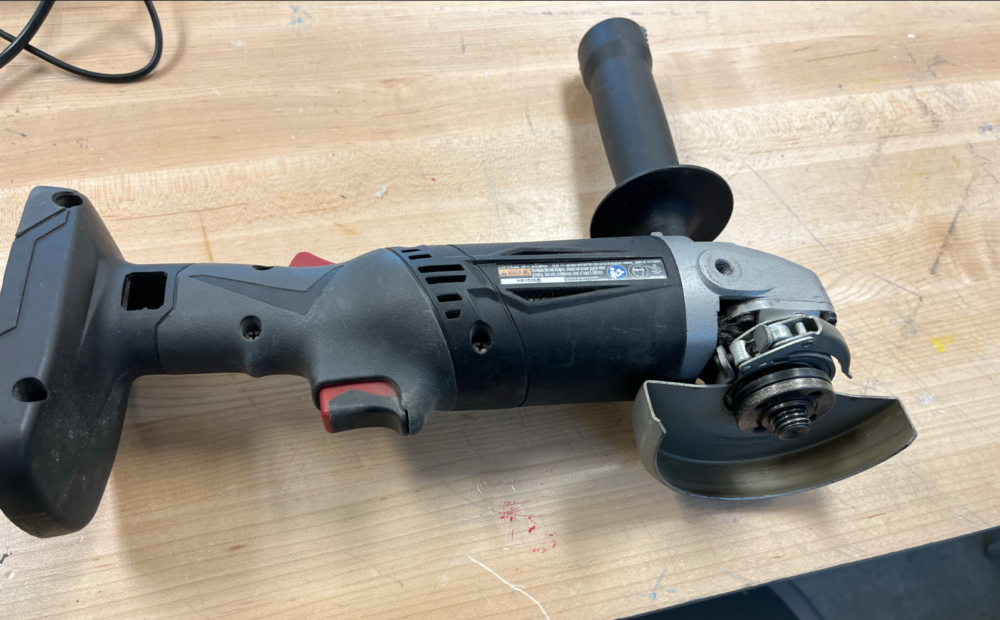

An angle grinder, also known as a side grinder or disc grinder, is a handheld power tool used for grinding (abrasive cutting) and polishing.

## Usage

* Extra blades are in the robot cage usually or maybe on the shelf behind the band saws.
* Be sure to hold with two hands, check which way the cutting surface will spin.
* Ensure you have safety glasses on.
* May need to have an apron or long sleeves on depending on type of material.
* Make sure the sparks are not going to get into any piece of equipment and everyone around you is wearing personal protective equipment.

## Safety



 

You may learn more by reading this [Angle Grinder Safety Guide](https://www.powertoolinstitute.com/pti-includes/pdfs/Tool-Specific-Files/Grinders.pdf) and
watching this [Power Tool Safety](http://www.powertoolinstitute.com/pti-pages/videos/Power-Tool-Safety-Video-2018/index.html) video.

## Useful Links

* [Learn More About Angle Grinders](https://en.wikipedia.org/wiki/Angle_grinder) from Wikipedia
* [How to Use an Angle Grinder](https://www.youtube.com/watch?v=puGg_UzpVo4) by Ace Hardware
