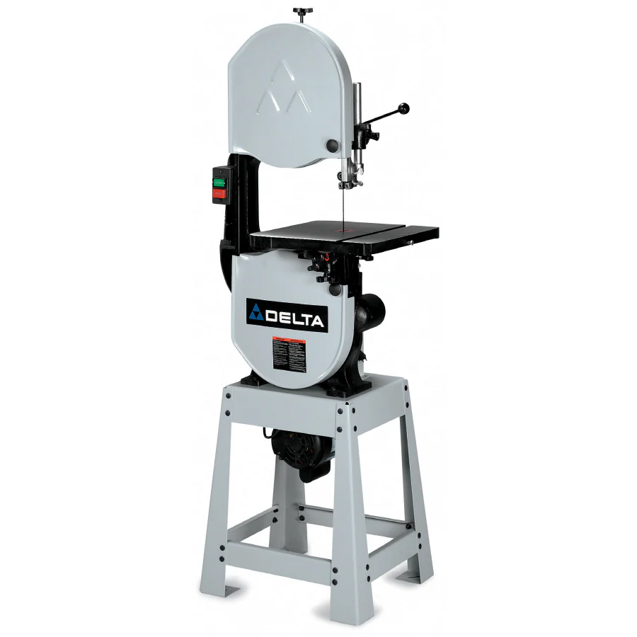

A band saw has a long, sharp blade consisting of a continuous band of toothed metal stretched between two or more wheels to cut material. They are used principally in woodworking, metalworking, and lumbering, but may cut a variety of materials. Advantages include uniform cutting action as a result of an evenly distributed tooth load, and the ability to cut irregular or curved shapes like a jigsaw.[1] The minimum radius of a curve is determined by the width of the band and its kerf. Most bandsaws have two wheels rotating in the same plane, one of which is powered, although some may have three or four to distribute the load. The blade itself can come in a variety of sizes and tooth pitches (teeth per inch, or TPI), which enables the machine to be highly versatile and able to cut a wide variety of materials including wood, metal and plastic. Band saw is recommended for use in cutting metal as it produces much less toxic fumes and particulates when compared with angle grinder and reciprocating saw.

The shop has two [Delta](./Delta_Band_Saw.pdf) band saws.

## Safety

You may learn more by reading this [Band Saw Safety Guide](https://www.powertoolinstitute.com/pti-includes/pdfs/Tool-Specific-Files/Band-Saws.pdf) and
watching this [Power Tool Safety](http://www.powertoolinstitute.com/pti-pages/videos/Power-Tool-Safety-Video-2018/index.html) video.

## Useful Links

* [Product Manual](./Delta_Band_Saw.pdf)
* [Learn More About Band Saws](https://en.wikipedia.org/wiki/Band_saw) from Wikipedia
* [How to Use a Bandsaw](https://www.youtube.com/watch?v=6XPK9xJyEPs) video from Fix This Build That
