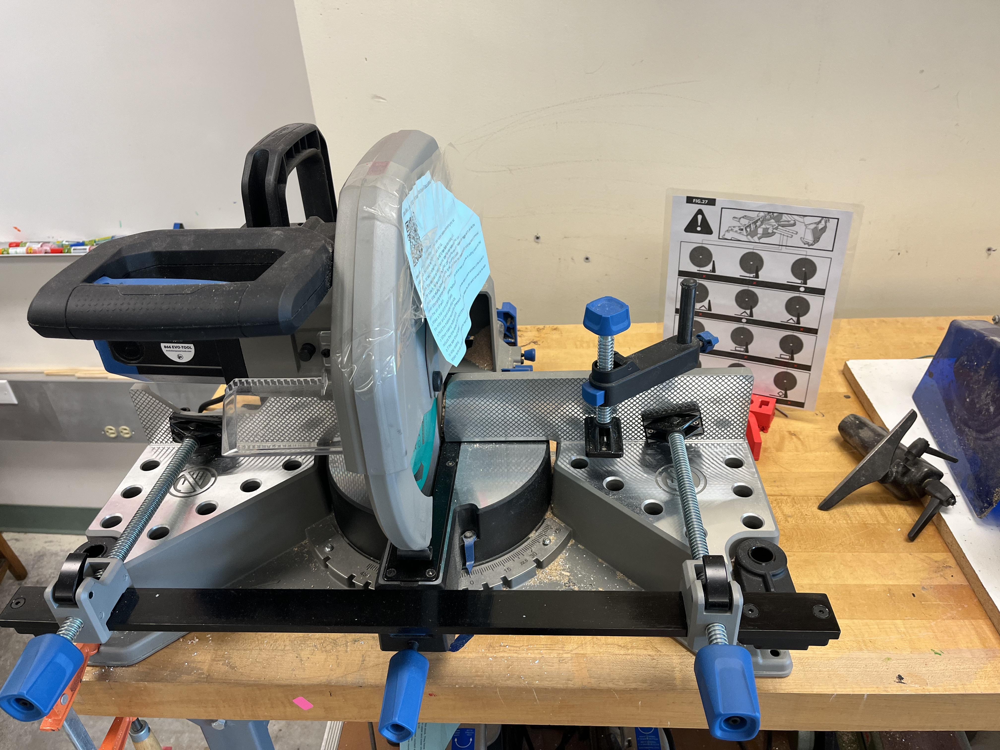

Please see the links below as a place to start

* Avoid distractions.
* Make sure the saw is securely attached to a table or base support before attempting any cut.
* Hold or clamp the material securely before making any cut.
* Keep hands at least 4 inches away from the rotating saw blade when making a cut.
* Make sure the electrical cord and plug are in good operating order before using the saw.
* After the saw blade has cut through the material, continue to hold the saw down, release the trigger switch, and let the saw blade stop rotating before allowing the blade to return to its starting position.
* Never attempt to remove scrap material from the cut zone until the blade has stopped rotating and your hand is removed from the on/off switch.
* Make a trial cut on a piece of scrap material before attempting final cuts to make sure the saw is cutting properly and that the miter and bevel angles are set accurately.
* Hold the material securely when making cuts.
* When making multiple cuts of the same dimensions, clamp a stop on the saw table to assure accuracy of the cut and to reduce the time needed to make the cuts.
* If the saw should kickback, continue to hold it firmly in the down position, release the off/on switch and wait for the blade to stop rotating.
* Make sure ear protection is on and everyone near you is also on.

# Review videos:




# Safety Guide


# Additonal Links 
* [Additional instructions from Power Tool Institute](https://www.powertoolinstitute.com/pti-pages/tools/Miter-Saws.asp)

# Manual

