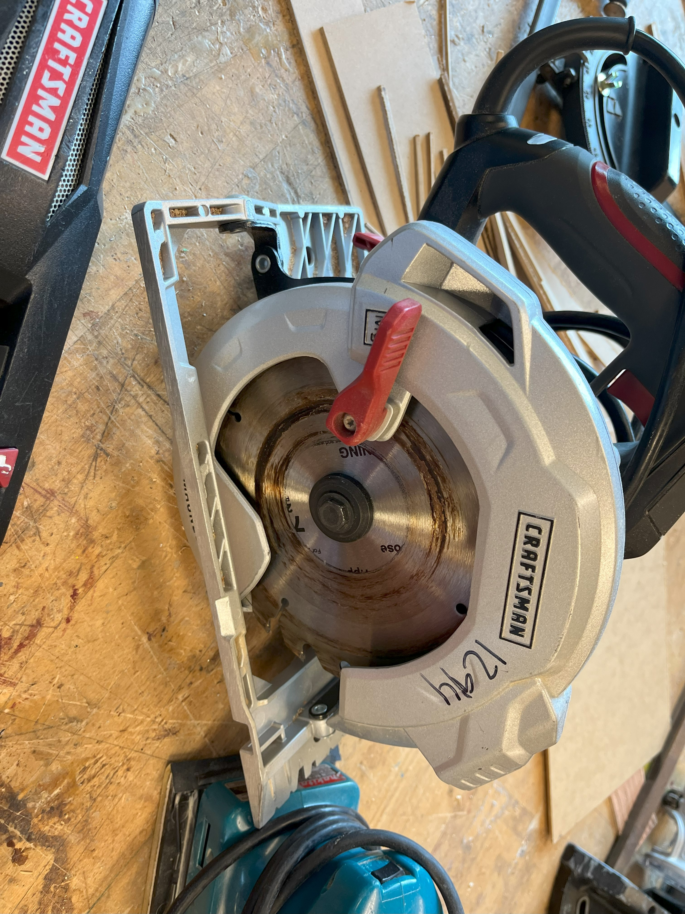

A circular saw or a buzz saw, is a power-saw using a toothed or abrasive disc or blade to cut different materials using a rotary
motion spinning around an arbor.

## Usage

This tool produces a ton of dust so ensure the material you are cutting is very secure. Ask for another to spot and help manage materials.

Ensure the blade will not cut into table holding material,
Use Clamps and mimic path without power on to ensure nothing will interfere with cutting path
Eye and Ear protection are required

## Safety



 

You may learn more by reading this [Circular Saw Safety Guide](https://www.powertoolinstitute.com/pti-includes/pdfs/Tool-Specific-Files/Circular-Saw.pdf) and
watching this [Power Tool Safety](http://www.powertoolinstitute.com/pti-pages/videos/Power-Tool-Safety-Video-2018/index.html) video.

## Useful Links

* [Learn More About Circular Saws](https://en.wikipedia.org/wiki/Circular_saw) from Wikipedia
* [How to Use a Circular Saw](https://www.youtube.com/watch?v=bflTi41S6Og) from Training Hands Academy
