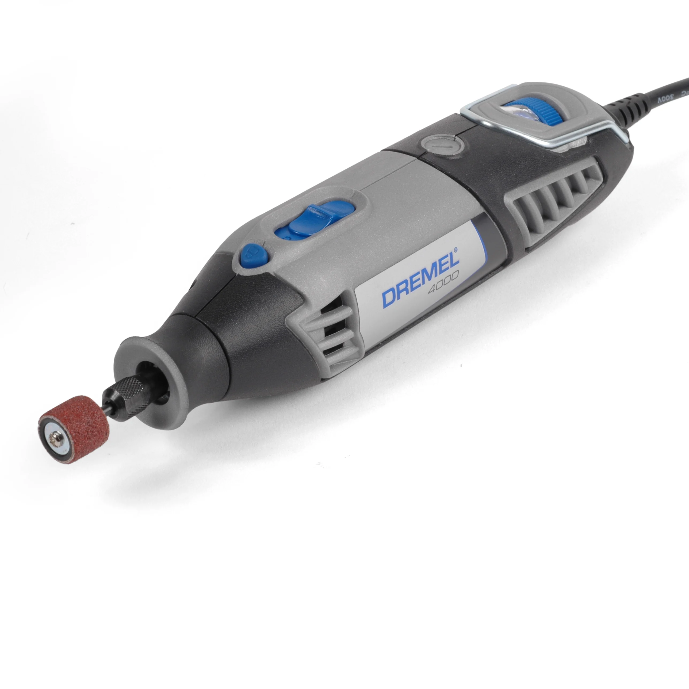

## Usage

Inspect the dremel prior to each use for any damage. If you find any, do not use it.

● Use only the right bits and attachments.
● Insert all bits fully into the dremel’s collet or chuck.
● Do not stand within the bits rotating plane to avoid any expelled particles.
● Wear goggles, safety glasses, gloves, and hearing protection.
● Make sure other people stay out of the work area to avoid flying material or broken bits.
● Fix the material or object in a vice before cutting. Do not hold the material with one hand while cutting with the other.
● Hold the dremel cutting tool firmly while using it.
● Do not start the dremel in the middle of a cut. Let it spin to full speed before approaching the material.
● Never put the dremel down until it has fully stopped rotating.

## Safety

You may learn more by reading this [Dremel Safety Guide](https://www.dremel.com/gb/en/dremel-safety-guidelines).
