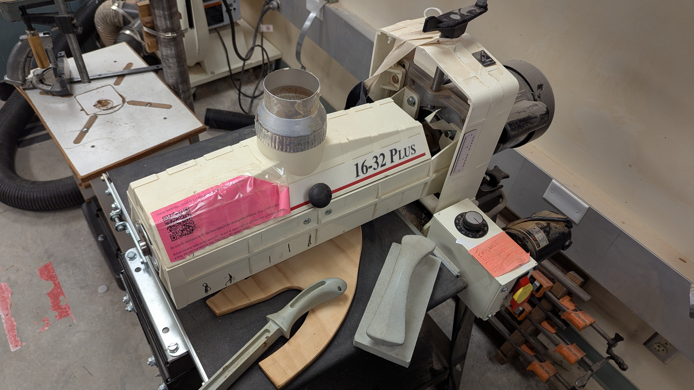

## Usage

Be sure air ventilation is on. We have replacement sanding belts in Drawer 15 or In D124 in Sanding Tote on West wall.

Bottom sanding table moves wood into, be sure to adjust height of spinning drum to not take off more than 2mm of wood at a time, the machine tends to stop. Feel free to take multiple passes.

## Safety

You may learn more by
watching this [Power Tool Safety](http://www.powertoolinstitute.com/pti-pages/videos/Power-Tool-Safety-Video-2018/index.html) video.

## Useful Links

* [Product Manual](./Performax_16-32_Plus_Drum_Sander.pdf)
