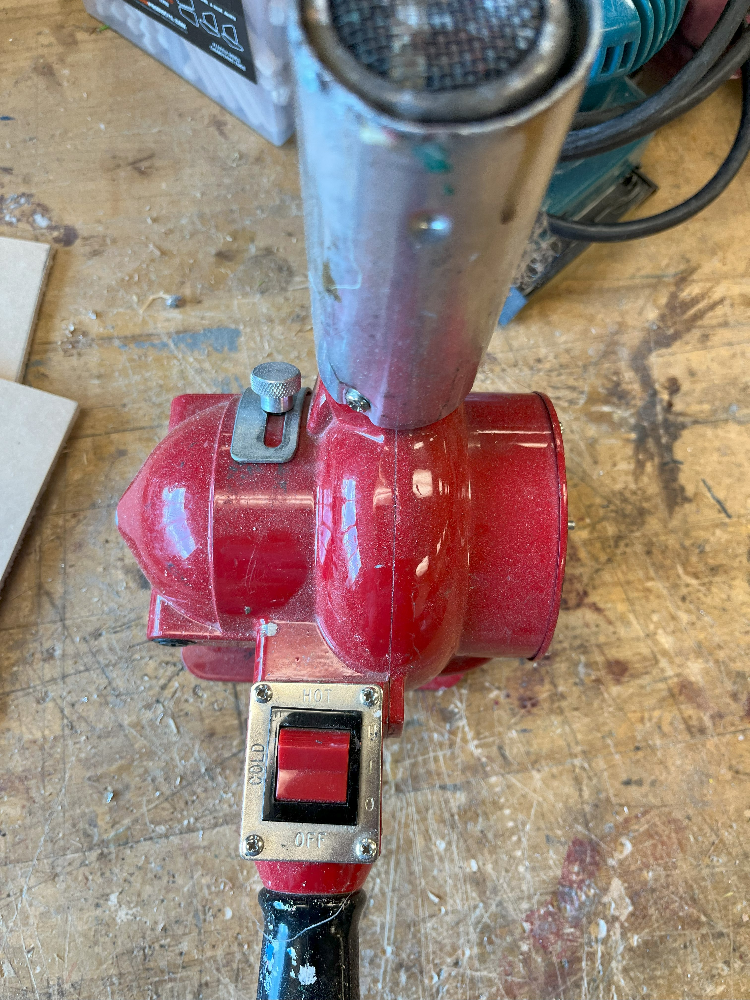

A heat gun is like an extra hot and powerful hair dryer which gets to over 500F.

## Usage

* Be sure to respect the nozzle by placing it on its based with air going upwards.

* When dealing with materials that create fumes, be sure to go outside, wear a mask, and or use the fume hood in D124.

* Never point a head gun at a person, it can result in serious injuries.

## Safety

You may learn more by reading this [Heat Gun Safety Guide](https://www.powertoolinstitute.com/pti-includes/pdfs/Tool-Specific-Files/Heat-Guns.pdf) and
watching this [Power Tool Safety](http://www.powertoolinstitute.com/pti-pages/videos/Power-Tool-Safety-Video-2018/index.html) video.

## Useful Links

* [Learn More About Heat Guns](https://en.wikipedia.org/wiki/heat_gun) from Wikipedia
