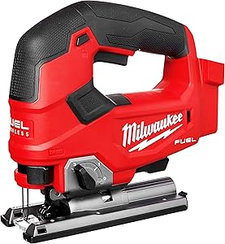

A jig saw is a reciprocating saw that can cut irregular curves, such as stenciled designs, in wood, metal, or other materials.

The shop has a [Milwaukee M18 Fuel D-Handle Jig Saw](./Milwaukee_M18_Jig_Saw.pdf).

## Safety

You may learn more by reading this [Jig Saw Safety Guide](https://www.powertoolinstitute.com/pti-includes/pdfs/Tool-Specific-Files/Jig-Saw.pdf) and
watching this [Power Tool Safety](http://www.powertoolinstitute.com/pti-pages/videos/Power-Tool-Safety-Video-2018/index.html) video.

## Useful Links

* [Product Manual](./Milwaukee_M18_Jig_Saw.pdf)
* [Learn More About Jig Saws](https://en.wikipedia.org/wiki/Jig_saw) from Wikipedia
* [How to Use a Jig Saw](https://www.youtube.com/watch?v=_ztM_Y_PlAo&t=334s) video from Training Hands Academy
