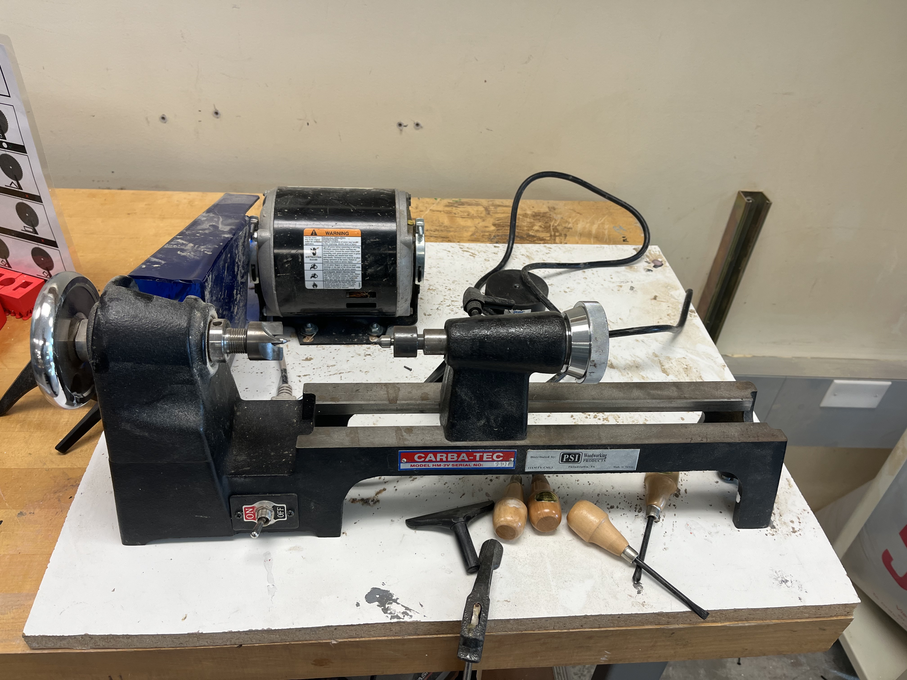

A lathe is a machine tool that rotates a workpiece about an axis of rotation to perform various operations such as cutting, sanding, knurling, drilling, deformation, facing, threading and turning, with tools that are applied to the workpiece to create an object with symmetry about that axis.

## Usage

This is a very weak lathe. Be sure to check all attachment points and secure to spindle with more than friction. Go slow at the beginning. The direction of spin makes the object fly away from you mostly.

All L handles turn to fasten an adjustable portion of the lathe.

Use a hammer or drill to get one side as far onto the four teeth spindle as you can.

Turn right side spindle tighten on from the right

## Safety

You may learn more by reading this [Wood Lathe Safety Guide](https://www.powertoolinstitute.com/pti-includes/pdfs/Tool-Specific-Files/Wood-Lathes.pdf) and
watching this [Power Tool Safety](http://www.powertoolinstitute.com/pti-pages/videos/Power-Tool-Safety-Video-2018/index.html) video.

## Useful Links

* [Learn More About Lathes](https://en.wikipedia.org/wiki/Lathe) from Wikipedia
* [Wood Turning Lathe from A to Z](https://www.youtube.com/watch?v=y_iYYLBCXV8) video from Roger Webb
