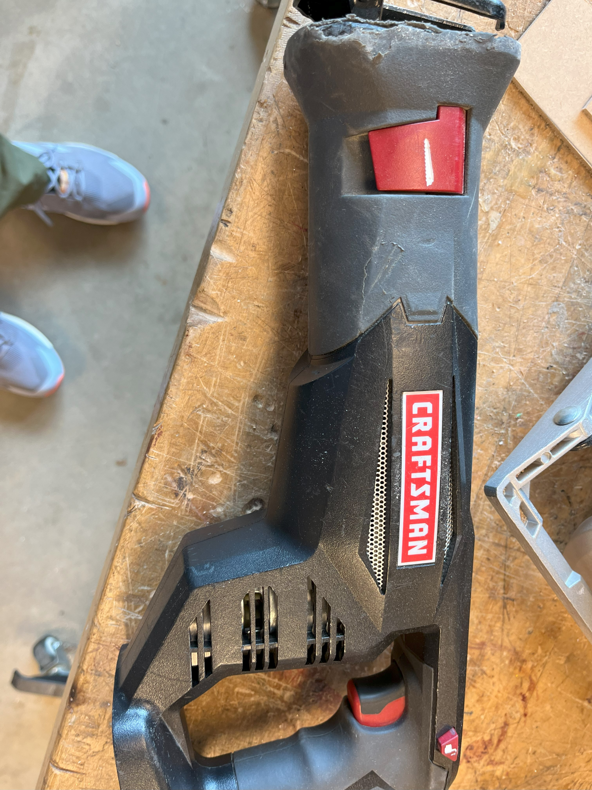

A reciprocating saw, also known as a sawzall, is a type of handheld, small, machine-powered saw, in which the cutting action is achieved through
a push-and-pull ("reciprocating") or back-and-forth motion of the blade.

## Usage

* Extra blades are on the shelf behind the band saws. We have some that are specifically for very strong metals and some that are longer.

## Safety

You may learn more by reading this [Reciprocating Saw Safety Guide](https://www.powertoolinstitute.com/pti-includes/pdfs/Tool-Specific-Files/Reciprocating-Saws.pdf) and
watching this [Power Tool Safety](http://www.powertoolinstitute.com/pti-pages/videos/Power-Tool-Safety-Video-2018/index.html) video.

## Useful Links

* [Learn More About Reciprocating Saws](https://en.wikipedia.org/wiki/Reciprocating_saw) from Wikipedia
* [How to Use a Reciprocating Saw](https://www.youtube.com/watch?v=8F2Owjt8Qpw) video from Ace Hardware
