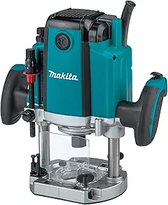

The router is a power tool with a flat base and a rotating blade extending past the base. It routs (hollows out) an area in hard material, such as wood or plastic. Routers are
used most often in woodworking, especially cabinetry. They may be handheld or affixed to router tables. Some woodworkers consider the router one of the most versatile power tools.

## Safety

You may learn more by reading this [Router Safety Guide](https://www.powertoolinstitute.com/pti-includes/pdfs/Tool-Specific-Files/Routers.pdf) and
watching this [Power Tool Safety](http://www.powertoolinstitute.com/pti-pages/videos/Power-Tool-Safety-Video-2018/index.html) video.

## Useful Links

* [Learn More About Routers](https://en.wikipedia.org/wiki/Router_(woodworking)) from Wikipedia
* [How to Use a Router](https://www.youtube.com/watch?v=mcLBmdYs5iU) video from Training Hands Academy
