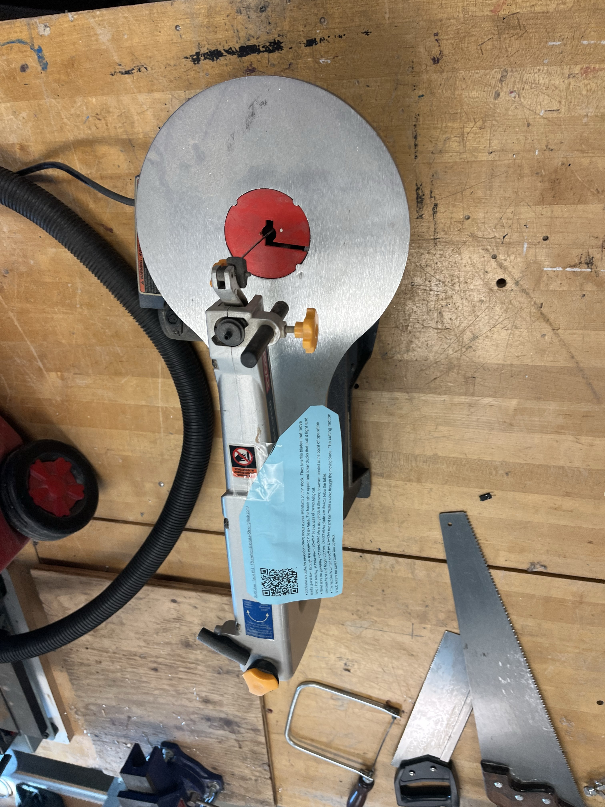

Scroll saws are useful for precision-cutting intricate curves and patterns on thin stock. They have thin blades that move rapidly up and down through the opening in the saw table. The blade is held in upper and lower chucks that pull it tight and keep it from bending. A hold-down adjusts to the thickness of the wood being cut.

## Usage

* Scroll saws are generally not considered to be as dangerous as other saws; however, contact at the point of operation can cause hand and finger injuries. Contact with the blade can also occur below the table.

* The saw is turned on/off by a switch or knob and the material is pushed through the moving blade. The cutting motion should always be away from the operator.

## Safety

You may learn more by watching this [Power Tool Safety](http://www.powertoolinstitute.com/pti-pages/videos/Power-Tool-Safety-Video-2018/index.html) video.

## Useful Links

* [Learn More About Scroll Saws](https://en.wikipedia.org/wiki/Scroll_saw) from Wikipedia
* [How to Use a Scroll Saw](https://www.youtube.com/watch?v=KVqdbXQwQ1I) video from Caleb's Shop
